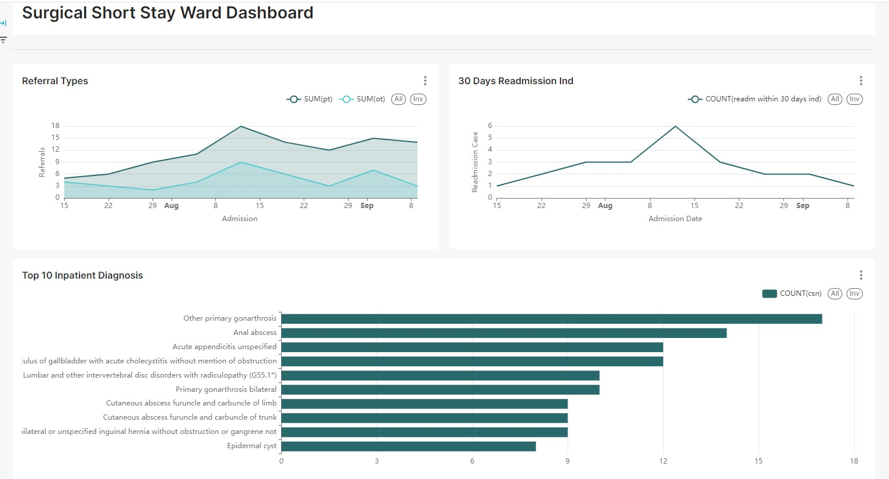

# CLOUDSCALE: AUTOMATED REPORT GENERATION USING AWS CLOUD SERVICES

This repository is dedicated to the creation and management of the Apache Superset application, as part of our SCTP capstone project. The Superset instance is deployed using AWS infrastructure, including ECS clusters, and this repository contains the necessary files for configuring and managing Superset.

Here’s a section you can add to the **Superset** repository’s `README.md` to explain what Apache Superset is:

---

## What is Apache Superset?

[Apache Superset](https://superset.apache.org/) is an open-source data exploration and business intelligence (BI) platform designed to help users visualize and analyze data. Superset provides a rich set of features that allow for easy creation of dashboards and interactive data visualizations without requiring any programming knowledge.



### Key Features of Apache Superset:
- **Interactive Dashboards:** Create real-time, interactive dashboards with a variety of chart types.
- **SQL Lab:** A powerful SQL editor with autocomplete that allows users to query data, explore datasets, and save queries for later use.
- **Data Exploration:** Explore data from different sources, allowing users to slice, dice, and drill down into data using intuitive filters.
- **Extensibility:** Superset supports plugins, allowing users to extend its functionality and integrate with a wide range of external data sources.
- **Secure and Scalable:** Superset is designed to handle large volumes of data, and it includes security features like role-based access control (RBAC) and database authentication.

### Why Use Apache Superset?
Apache Superset provides a flexible, user-friendly platform for organizations to turn raw data into valuable insights. Its open-source nature makes it accessible to anyone, and it integrates easily with cloud services, relational databases, and data warehouses. Superset’s versatility and scalability make it a suitable BI solution for small teams or large enterprises alike.


## Architecture Overview

The Superset application is deployed in two environments:
- **Production** (`superset-prod`): Hosted in an ECS cluster (AZ-1).
- **Development** (`superset-dev`): Hosted in an ECS cluster (AZ-2).

Both environments are managed using task definitions stored in ECR. Superset instances in these clusters are connected to the frontend for end-user access, providing a powerful business intelligence (BI) tool for data visualization and analysis.


## Key Components

1. **Amazon ECS**  
   The application is deployed in Elastic Container Service (ECS) clusters:
   - **ECS Cluster (superset-prod)** for production.
   - **ECS Cluster (superset-dev)** for development.

2. **Amazon ECR**  
   The Docker images for the Superset application are stored in Amazon Elastic Container Registry (ECR).

3. **Task Definitions**  
   Each environment has its own task definition, ensuring proper scaling and resource allocation.

4. **IAM and Security**  
   Access control and permissions are managed through IAM policies, ensuring secure and controlled access to the application and resources.

## Getting Started

### Prerequisites
- AWS CLI configured with appropriate IAM permissions.
- Docker installed locally.
- Superset Docker images pushed to the ECR repository.

### Deployment

1. **Clone the Repository:**

   ```bash
   git clone https://github.com/chrysaliswoon/sctp-capstone-superset.git
   cd sctp-capstone-superset
   ```

2. **Build and Push Superset Image:**

   ```bash
   # Build the Docker image for Superset
   docker build -t superset:latest .

   # Tag the image for ECR
   docker tag superset:latest <your-aws-account-id>.dkr.ecr.<region>.amazonaws.com/superset-repo:latest

   # Push the image to ECR
   docker push <your-aws-account-id>.dkr.ecr.<region>.amazonaws.com/superset-repo:latest
   ```

3. **Deploy the ECS Task Definition:**
   Update the task definitions in the repository, ensuring the correct image and environment variables are configured, then deploy to your ECS clusters using the AWS CLI or AWS Management Console.

### Management

You can manage your Superset containers through the AWS ECS console, updating services or scaling as needed. Logs and metrics are available through Amazon CloudWatch.

## Troubleshooting

- Ensure Docker images are correctly built and pushed to ECR.
- Verify that the ECS task definitions are using the latest ECR image.
- Check IAM roles for appropriate permissions.
- Use CloudWatch logs to monitor application performance.

## License

This project is licensed under the MIT License - see the [LICENSE](LICENSE) file for details.